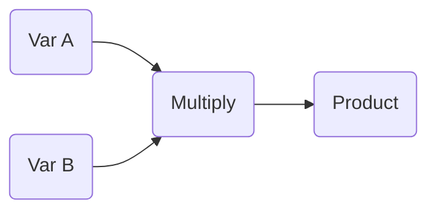

This document shows how to multpily two numbers using the `swimm_test` library. The necessary code is in the `📄 test2.cpp` file. Here is a code snippet:

<br/>


<!-- NOTE-swimm-snippet: the lines below link your snippet to Swimm -->
### 📄 test2.cpp
```c++
17     int multiply(int a, int b){
18       return a*b;
19     }
```

<br/>

The `multiply`<swm-token data-swm-token=":test2.cpp:17:2:2:`int multiply(int a, int b){`"/>function accepts two integers and returns their product.

Here is a workflow:

<br/>

<!--MERMAID {width:100}-->

<!--MCONTENT {content: "graph LR<br/>\nA(Var A)\\-\\-\\>C(Multiply)<br/>\nB(Var B)\\-\\-\\>C<br/>\nC\\-\\-\\>D(Product)<br/>\n<br/>"} --->

<br/>

This file was generated by Swimm. [Click here to view it in the app](https://app.swimm.io/repos/Z2l0aHViJTNBJTNBc3dpbW1fdGVzdCUzQSUzQWluZmluaXRyb24=/docs/sn4yczg5).
